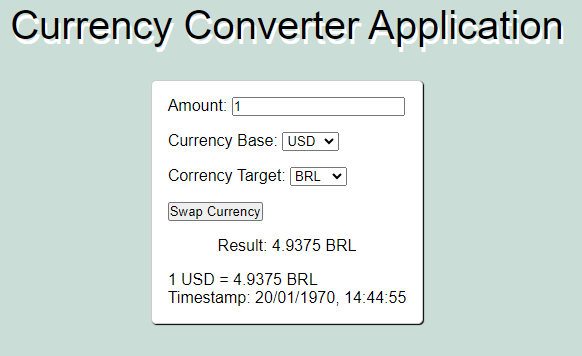
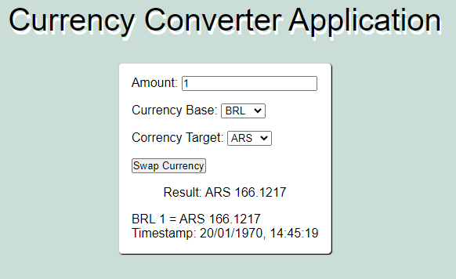
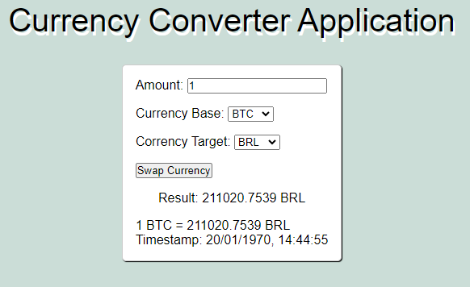

# Currency Converter

**Descrição**

Currency Converter é um aplicativo web que permite converter o valor de uma moeda para outra. O aplicativo é feito em React e ASP.NET e usa a API do site fixer.io para obter as taxas de câmbio.

**Recursos**

* Converte entre mais de 100 moedas
* Permite definir moedas base e de destino
* Atualiza automaticamente as taxas de câmbio

**Objetivos**

O objetivo do Currency Converter é fornecer uma ferramenta fácil de usar para converter moedas.

**Instruções de instalação**

**Requisitos de sistema**

* Node.js 20.10.0
* NPM 10.2.3
* .NET 8.0.0

**Instalação do aplicativo frontend**

1. Entre na pasta do aplicativo frontend
2. Execute o comando `npm install` para instalar as dependências
3. Execute o comando `npm run dev` para iniciar o aplicativo em modo de desenvolvimento

**Instalação da API**

1. Entre na pasta backend
2. Crie uma variável de ambiente chamada `ACCESS_KEY` em um arquivo .env, sendo ela uma access_key da API do fixer.io
3. Compile e execute em modo de desenvolvimento usando o comando `dotnet run`

**Screenshots**

