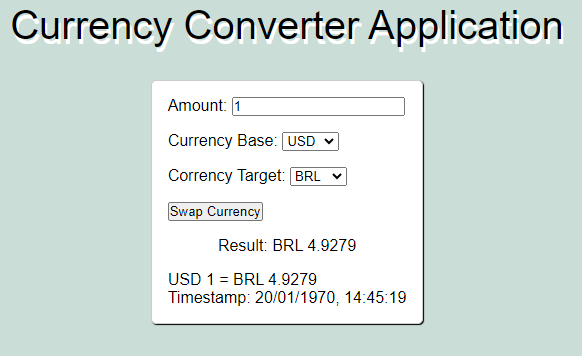

# Currency Converter

**Description**

Currency Converter is a web application that allows converting the value of one currency to another. The application is built with React and ASP.NET and utilizes the fixer.io website API to fetch exchange rates.

**Features**

* Converts between more than 100 currencies
* Allows setting base and target currencies
* Automatically updates exchange rates

**Objectives**

The objective of Currency Converter is to provide an easy-to-use tool for currency conversion.

**Installation Instructions**

**System Requirements**

* Node.js 20.x
* NPM 10.x
* .NET 8.x

**Frontend Application Installation**

1. Navigate to the frontend application folder
2. Run `npm install` command to install dependencies
3. Run `npm run dev` command to start the application in development mode

**API Installation**

1. Navigate to the backend folder
2. Create an environment variable named `ACCESS_KEY` in a .env file, with an access_key from the fixer.io API
3. Compile and run in development mode using the `dotnet run` command

**Docker Compose**

If you have Docker installed, you can also run the project using Docker Compose.

1. Navigate to the project directory where the `docker-compose.yml` file is located

2. Run `docker-compose up --build` command to build and start the containers

**Screenshots**

